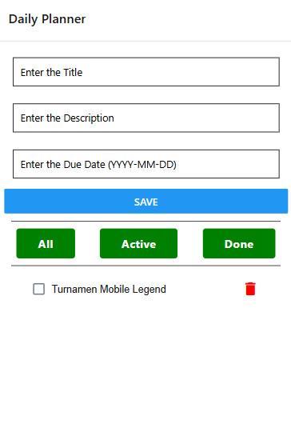
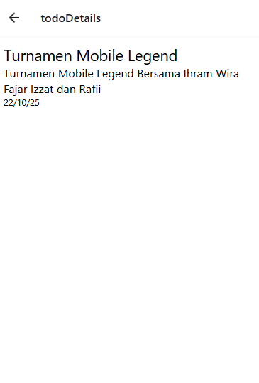

# Daily Planner App

Daily Planner App adalah aplikasi mobile yang dibangun menggunakan React Native untuk membantu pengguna mengelola daftar tugas mereka. Aplikasi ini memungkinkan pengguna untuk menambahkan, menyaring, menandai, dan menghapus tugas dari daftar mereka dengan mudah. Dengan fitur manajemen status tugas (Aktif, Selesai) dan penyimpanan data lokal, aplikasi ini menyediakan solusi yang praktis untuk mengorganisir aktivitas sehari-hari.

## Fitur Utama

- **Menambahkan Tugas Baru**: Pengguna dapat menambahkan tugas baru dengan judul, deskripsi, dan tanggal jatuh tempo.
- **Status Tugas**: Pengguna dapat menandai tugas sebagai "Selesai" atau "Aktif".
- **Menghapus Tugas**: Pengguna dapat menghapus tugas dari daftar setelah selesai.
- **Menyaring Tugas**: Pengguna dapat menyaring tugas berdasarkan status (Semua, Aktif, Selesai).
- **Penyimpanan Lokal**: Semua data tugas disimpan secara lokal menggunakan `AsyncStorage`, yang memungkinkan aplikasi menyimpan tugas meskipun aplikasi ditutup.

## Screenshots

_Masukkan gambar screenshot aplikasi di sini._

## Teknologi yang Digunakan

Aplikasi ini dibangun menggunakan beberapa teknologi dan library untuk memberikan pengalaman pengguna yang optimal:

- **React Native**: Framework untuk membangun aplikasi mobile menggunakan JavaScript dan React.
- **Redux**: Library manajemen status untuk mengelola status aplikasi secara global, memungkinkan kontrol yang lebih baik terhadap data yang berubah.
- **React Navigation**: Digunakan untuk mengelola navigasi antar layar dalam aplikasi.
- **AsyncStorage**: Penyimpanan data lokal yang memungkinkan data tetap ada meskipun aplikasi ditutup atau perangkat dimatikan.
- **React Native Paper**: Library UI berbasis Material Design untuk membangun antarmuka aplikasi yang konsisten.
- **React Native Elements**: Menggunakan komponen UI seperti tombol dan ikon yang sudah disediakan oleh library ini.
- **CheckBox**: Digunakan untuk menandai tugas sebagai selesai atau aktif.

## Instalasi

Untuk memulai proyek ini, ikuti langkah-langkah berikut:

### 1. Clone Repositori

Clone repositori ini ke komputer Anda dengan menggunakan perintah Git:

```bash
git clone https://github.com/Fajarshodiq1/UAS-M-Irham.git
cd <projek>
npm install
npm start
```

## Dokumentasi App



